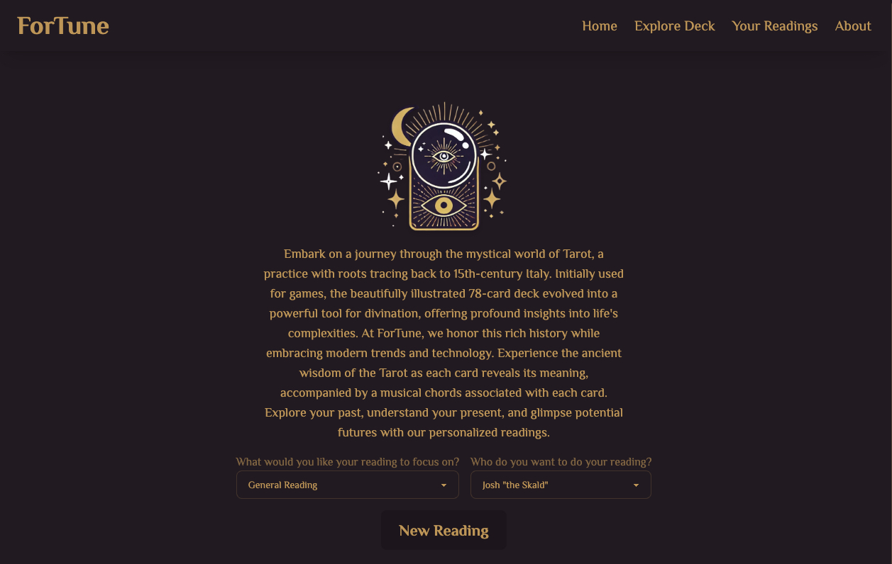
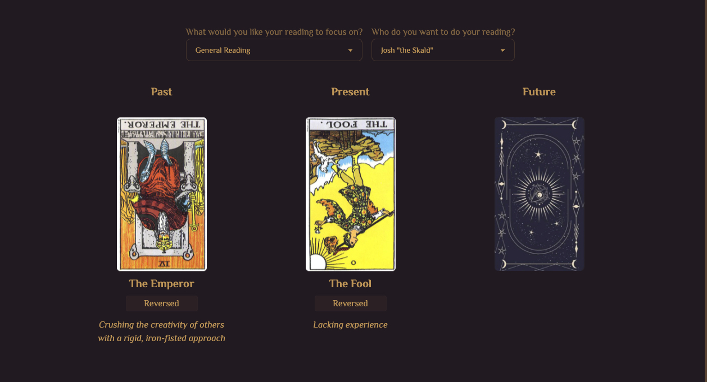
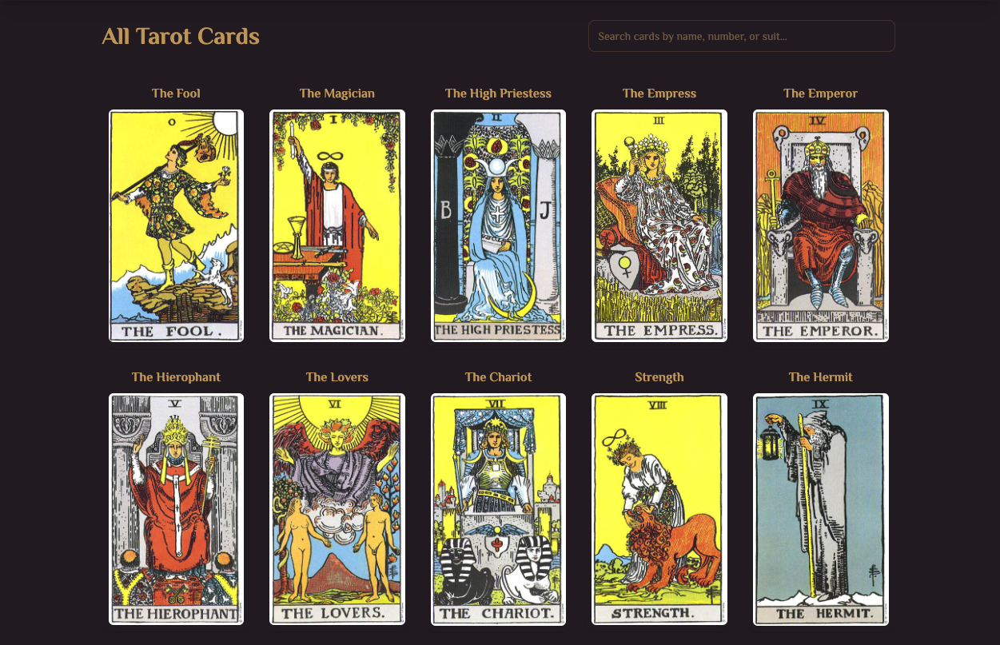

# ForTune - Interactive Tarot Reading Web Application

<div align="center">
  
  
[](https://app.netlify.com/sites/fortune-tell/deploys)
</div>

## Table of Contents
- [Overview](#overview)
- [Features](#features)
- [Technologies Used](#technologies-used)
- [Installation](#installation)
- [Usage](#usage)
- [Project Structure](#project-structure)
- [Contributing](#contributing)
- [License](#license)

## Overview
ForTune is a modern, interactive web application that provides personalized tarot readings. Built with React and enhanced with beautiful animations, it offers users an immersive experience into the mystical world of tarot. The application features a unique combination of visual elements, sound effects, and smooth transitions to create an engaging and authentic tarot reading experience.

## Features
- 🎴 Interactive 3-card tarot readings
- 🎵 Musical accompaniment for each card reveal
- 🎨 Smooth animations and transitions
- 📱 Responsive design for all devices
- 💾 Save and revisit past readings
- 🎭 Multiple reader personalities
- 🔮 Various reading focuses (Love, Career, School, etc.)
- 🖼️ Beautiful card illustrations
- 📜 Detailed card interpretations

## Technologies Used
- React.js
- Tailwind CSS
- DaisyUI
- Tone.js
- React Router
- Vite
- Netlify (Deployment)

## Installation
1. Clone the repository:
```bash
git clone https://github.com/rvrutan/tarot.git
```

2. Install dependencies:
```bash
cd fortune-tell
npm install
```

3. Start the development server:
```bash
npm run dev
```

## Usage
1. Visit the [live application](https://fortune-tell.netlify.app/)
2. Select your reading focus and preferred reader
3. Click "New Reading" to begin
4. Click on each card to reveal your reading
5. Save your reading for future reference

## Project Structure
```
tarot/
├── public/
│   ├── cards/          # Tarot card images
│   └── profile/        # Development team profile images
├── src/
│   ├── components/     # React components
│   ├── Pages/         # Page components
│   ├── assets/        # Static assets
│   └── main.jsx       # Application entry point
```

## Screenshots
<!-- Add your screenshots here -->
<div align="center">
  <h3>Home Page</h3>
  
  
  <h3>Reading Interface</h3>
  
  
  <h3>Card Reveal</h3>
  
</div>

## Contributing
Contributions are welcome! Please feel free to submit a Pull Request.

## License
This project is licensed under the MIT License - see the [LICENSE](LICENSE) file for details.

## Acknowledgments
- Tarot card data sourced from [Kaggle Tarot JSON Dataset](https://www.kaggle.com/datasets/lsind18/tarot-json)
- Special thanks to our team of tarot readers
